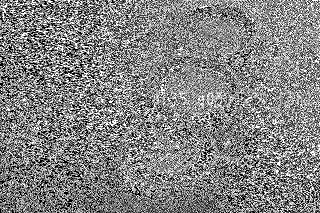

# Xissors-Or-Rock

## Description

I received two black and white images. One of them contains a lot of noise.  
Try to recover the flag hidden in [this image](../Xissors-Or-Rock/weird_1.png) with the help of [other one](../Xissors-Or-Rock/COFFEEx3_1.png)

## Attachments

`https://github.com/ainzs-evil-twin/ictf-Nov-2020/blob/main/Xissors-Or-Rock/COFFEEx3_1.png`  
`https://github.com/ainzs-evil-twin/ictf-Nov-2020/blob/main/Xissors-Or-Rock/weird_1.png`
 

## Flag format

`ictf{.+}`

## Category

Crypto, Forensics

## Hints

 
    
Hint 1
 
    Look at the challenge title carefully

